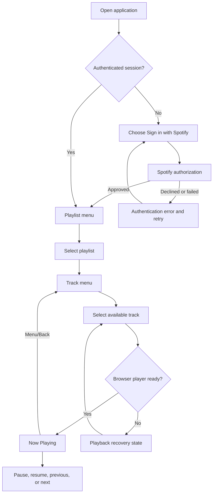
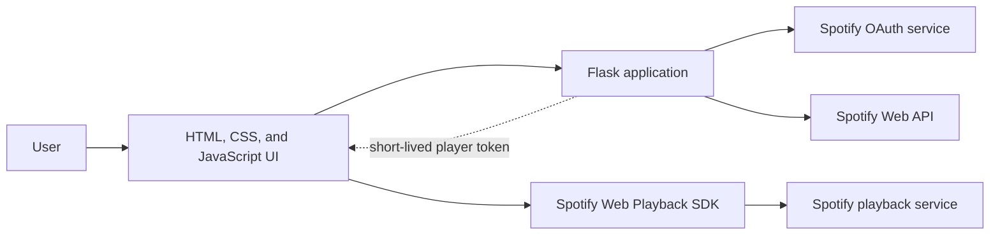

# Spotify iPod MVP Plan

## 1. Decision summary

Build a desktop-first, local web application that lets one Spotify Premium user sign in, browse playlists they own or collaborate on, select a track, and control playback through an iPod-inspired interface.

The MVP is a portfolio prototype for learning OAuth, API integration, UI state, accessibility, and testing. It is not a commercial product and is not intended for public scale.

## 2. Problem and product goal

Modern music applications expose many actions at once. This project tests a deliberately focused interaction model: can a user reach familiar music and control playback through a compact, nostalgic interface without losing clarity or accessibility?

The MVP succeeds when the developer can demonstrate this complete path reliably:

```text
Sign in -> View playlists -> Open one playlist -> Select a track
        -> Hear playback -> Pause/resume -> Skip forward/back
```

## 3. Target user

The initial user is the developer using a Spotify Premium account on a desktop browser. Up to four additional allowlisted testers may be invited later, but multi-user scale is not an MVP requirement.

## 4. Product principles

- Make the current selection and available action obvious.
- Preserve the feel of a click-wheel player without requiring a physical rotary gesture.
- Support mouse, touch, and keyboard input for every essential action.
- Show useful loading, empty, authentication, and playback-error states.
- Request only the Spotify permissions the MVP actually uses.
- Treat Spotify metadata and artwork according to Spotify's current attribution and display rules.

## 5. MVP scope

### Included

1. **Spotify sign-in and sign-out**
   - Start Spotify OAuth from the application.
   - Complete the callback securely.
   - Refresh an expired access token during an active session.
   - Clear the local application session on sign-out.

2. **Playlist browsing**
   - Display the signed-in user's owned and collaborative playlists as a simple menu.
   - Open one eligible playlist and display its available tracks.
   - Explain that development mode cannot retrieve the contents of other followed playlists.
   - Support loading, empty, and API-error states.

3. **iPod-inspired navigation**
   - Provide Menu/Back, Previous, Next, Play/Pause, and Select actions.
   - Move through menu items with explicit controls and keyboard equivalents.
   - Keep a visible focus/selection state.
   - Use a circular visual control, but do not require rotary gesture recognition in the MVP.

4. **Now Playing screen**
   - Show track title, artist, album, playback status, progress, and duration.
   - Show unmodified album art only when it fits the required display treatment.
   - Include Spotify attribution and a link to the corresponding Spotify content.

5. **Playback**
   - Initialize the Spotify Web Playback SDK as a browser device.
   - Start a selected track.
   - Pause/resume and move to the previous or next track.
   - Handle Premium/account, browser autoplay, inactive-device, and playback errors visibly.

6. **Responsive baseline**
   - Work in current desktop Chrome, Firefox, Safari, and Edge at a practical portfolio-demo size.
   - Remain usable on a narrow screen, while documenting that mobile autoplay behavior can differ.

### Explicitly excluded from the MVP

- Search across the full Spotify catalog
- Albums, podcasts, audiobooks, recommendations, or social features
- Editing, creating, following, or deleting playlists
- Saving tracks or downloading/caching Spotify content
- User accounts separate from Spotify
- A persistent application database
- Native mobile or desktop applications
- A realistic rotary/drag wheel gesture, haptics, or sound effects
- Themes, visualizers, lyrics, queues, shuffle, or repeat
- Public deployment, monetization, or an extended-quota application

## 6. User stories and acceptance criteria

### Story A: Authenticate

As a Spotify Premium user, I want to authorize the application so that it can display and play my music.

Acceptance criteria:

- The sign-in action redirects through Spotify's authorization page.
- The callback rejects an invalid or mismatched OAuth state value.
- Spotify client secrets and tokens never appear in committed files.
- A declined authorization returns the user to a useful error screen with a retry action.
- Refreshing the page during a valid session does not require an immediate new sign-in.

### Story B: Browse playlists

As an authenticated user, I want to browse my playlists and their tracks so that I can choose music without leaving the focused interface.

Acceptance criteria:

- The playlist menu has a clear selected item.
- Selecting a playlist opens its track list.
- A followed playlist whose contents are unavailable under development mode is excluded or clearly identified rather than opening an empty track list.
- Menu/Back returns to the previous screen and restores a sensible selection.
- Empty playlists, unavailable tracks, and API failures do not produce a blank screen.
- Long names remain readable through truncation plus an accessible way to obtain the full text.

### Story C: Play and control a track

As a user, I want to start and control playback so that the interface functions as a real music player.

Acceptance criteria:

- Selecting an available track starts it in the browser after any required user activation.
- Play/Pause accurately reflects and changes current state.
- Previous and Next update both playback and displayed metadata.
- The progress display is derived from current playback state rather than a fake animation.
- Playback failure explains the likely cause and offers a recovery action.

### Story D: Use keyboard controls

As a keyboard user, I want the same essential controls available without a pointer.

Acceptance criteria:

- Arrow keys move the menu selection.
- Enter activates Select.
- Escape or Backspace performs Menu/Back without triggering browser navigation.
- Space toggles playback when focus is not in another interactive control.
- Visible focus and semantic labels make controls understandable to assistive technology.

## 7. Primary user flow



## 8. Screen plan

### Welcome

- Project identity that does not imply Spotify or Apple endorsement
- Short explanation of the Premium requirement
- Sign-in action
- Privacy/permissions summary

### Playlist menu

- Screen title
- A short, paginated or incrementally loaded playlist list
- Current selection
- Loading, empty, and error variants

### Track menu

- Playlist name
- Track title and artist in each row
- Unavailable-track treatment
- Back navigation

### Now Playing

- Required Spotify attribution
- Unmodified album artwork where space allows
- Track, artist, and album metadata
- Progress and playback state
- Link to open the content in Spotify

### Shared controls

- Menu/Back at the top of the wheel
- Previous and Next at the left and right
- Play/Pause at the bottom
- Select in the center
- Visible keyboard focus independent of the selected menu row

Low-fidelity wireframes should be drawn and reviewed before styling begins.

## 9. Proposed technical boundary

Use Flask because it keeps authentication and server responsibilities in Python. Use vanilla browser code because the UI state is small enough that a frontend framework would add more setup than value. Spotify's Web Playback SDK remains a client-side JavaScript dependency because playback occurs in the browser.



### Responsibility split

| Component | Responsibility |
| --- | --- |
| Flask | OAuth state/callback, server-side session, token refresh, API error normalization, static/template delivery |
| Browser UI | Menu state, focus, keyboard/pointer events, rendering, player state display |
| Spotify Web API | Authorized playlist and track metadata |
| Web Playback SDK | Browser device registration, audio playback, and playback events |

No application database is needed for the single-user MVP. Authentication state should be session-scoped; the first local implementation may require signing in again after the server restarts rather than persisting refresh tokens prematurely.

## 10. Draft application routes

These are contracts to review before implementation, not implemented endpoints.

| Method | Route | Purpose |
| --- | --- | --- |
| `GET` | `/` | Render the current application shell or welcome state |
| `GET` | `/auth/login` | Create OAuth state and redirect to Spotify |
| `GET` | `/auth/callback` | Validate state and exchange the authorization code |
| `POST` | `/auth/logout` | Clear the local application session |
| `GET` | `/api/session` | Return only the UI-safe authentication state |
| `GET` | `/api/player-token` | Return a valid short-lived token for the playback SDK |
| `GET` | `/api/playlists` | Return a normalized page of owned/collaborative playlists eligible for content browsing |
| `GET` | `/api/playlists/<playlist_id>/tracks` | Return normalized items from one eligible owned/collaborative playlist |

Spotify scopes should be finalized against the current endpoint documentation immediately before coding. Start with the minimum needed for streaming, private playlist reading, and any Web API playback command actually used.

## 11. Conceptual state model

The application does not own Spotify music data. It temporarily represents:

- **Session:** authenticated/not authenticated, token expiry, OAuth state
- **Navigation:** current screen, selected index, navigation history
- **Playlist:** Spotify ID, name, ownership/collaboration eligibility, image/link metadata
- **Track:** Spotify URI/ID, availability, title, artist, album, duration, artwork/link metadata
- **Player:** device readiness, current track, paused state, position, duration, error

Spotify remains the source of truth. Do not build a local catalog or cache of Spotify content.

## 12. Security and policy requirements

- Keep the client secret and all tokens out of Git and logs.
- Load secrets from environment variables and provide only variable names in `.env.example`.
- Generate and validate OAuth state for every authorization attempt.
- Use exact registered redirect URIs and secure cookie settings appropriate to the environment.
- Request the smallest practical set of scopes.
- Treat expired/revoked sessions and Spotify `401`, `403`, and `429` responses explicitly.
- Do not download, transform, crop, overlay, or create a separate cache/database of Spotify content.
- Include the required Spotify attribution and content links wherever Spotify metadata or playback appears.
- Recheck Spotify Developer Policy, Design Guidelines, quota mode, and Web Playback SDK requirements before release.
- Choose a distinct public product name and visual identity before deployment; the retro hardware inspiration should not imply Apple endorsement.

## 13. Implementation slices

Each slice should end with a runnable behavior and focused tests.

1. **Foundation**
   - Create the Flask application factory and configuration boundary.
   - Add a health/welcome page, `.env.example`, and initial pytest setup.
   - Verify no secrets are tracked.

2. **Authentication**
   - Implement login, callback, state validation, session state, token refresh, and logout.
   - Test success, denial, mismatched state, missing configuration, and expired token behavior.

3. **Playlist API boundary**
   - Fetch and normalize playlists plus eligible playlist items using Spotify's current `/items` endpoint and response fields.
   - Filter or label playlists whose contents are unavailable in development mode.
   - Handle pagination, unavailable data, authorization failures, and rate limits.
   - Test against recorded, sanitized response fixtures rather than live Spotify calls.

4. **Accessible menu shell**
   - Build the screen and explicit wheel buttons.
   - Implement selection, back navigation, pointer input, and keyboard input using local fixture data.
   - Test state transitions separately from styling.

5. **Playback integration**
   - Register the browser player, activate it from a user action, select tracks, and subscribe to player state.
   - Add truthful progress and recovery states.

6. **Compliance and polish**
   - Apply attribution, artwork, metadata, link, responsive, and accessibility requirements.
   - Test the complete flow in supported browsers and document known mobile limits.

## 14. Test strategy

- **Unit tests:** configuration validation, OAuth state, token refresh decisions, Spotify response normalization, navigation reducer/state machine, time formatting
- **Route tests:** unauthenticated access, callback outcomes, logout, upstream Spotify errors
- **UI tests:** keyboard parity, selection boundaries, back stack, loading/empty/error states
- **Integration tests:** mocked Spotify API and SDK adapters; no required network access in the normal test suite
- **Manual tests:** real Premium login, first playback activation, browser device readiness, skip behavior, content links, current desktop browsers

## 15. MVP definition of done

The MVP is complete only when:

- One allowlisted Premium user with an owned or collaborative playlist can complete the primary flow from a clean session.
- The five essential controls work with mouse and keyboard.
- Displayed metadata and progress match actual player state.
- Authentication denial, empty playlists, unavailable tracks, autoplay blocking, offline player, and rate-limit errors have visible recovery paths.
- Secrets are absent from Git history and logs.
- Automated tests cover the application-owned state and failure handling.
- The README contains reproducible local setup and test commands.
- Spotify attribution, links, metadata, artwork, and non-commercial restrictions have been reviewed against the then-current official rules.

## 16. Decisions to confirm before the first code slice

1. Confirm that a Spotify Premium account and an available Spotify developer Client ID are available.
2. Confirm the working product name for the UI; do not default to the repository name for a public brand.
3. Draw and review low-fidelity Welcome, Playlist, Track, Now Playing, and error-state wireframes.
4. Recheck the exact Spotify scopes and development-mode endpoint availability.

The first coding slice should not begin until these decisions are settled.

## 17. Current official references

- [Spotify Web Playback SDK overview](https://developer.spotify.com/documentation/web-playback-sdk)
- [Spotify authorization concepts](https://developer.spotify.com/documentation/web-api/concepts/authorization)
- [Spotify quota modes](https://developer.spotify.com/documentation/web-api/concepts/quota-modes)
- [February 2026 development-mode migration guide](https://developer.spotify.com/documentation/web-api/tutorials/february-2026-migration-guide)
- [Spotify Design and Branding Guidelines](https://developer.spotify.com/documentation/design)
- [Spotify Developer Policy](https://developer.spotify.com/policy)

These links describe current constraints, not permanent guarantees. Review them again before implementation and before any public release.
