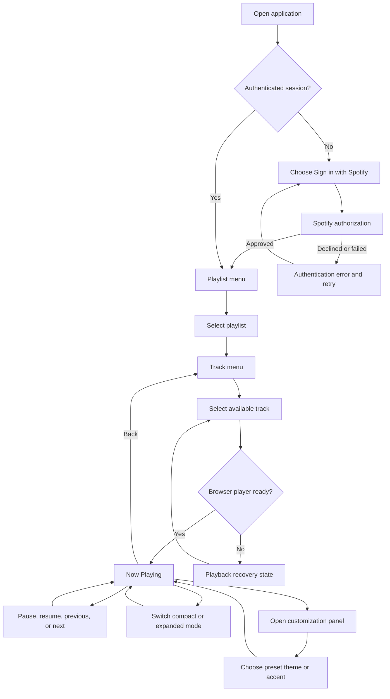
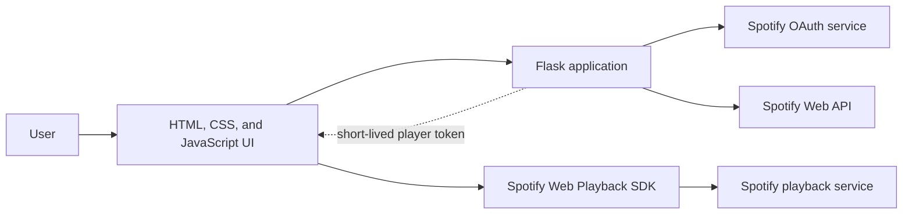

# Spotify Pocket Player MVP Plan

## 1. Decision summary

Build a desktop-first, local web application that lets one Spotify Premium user sign in, browse playlists they own or collaborate on, select a track, and control playback through a compact, customizable player interface.

The player has compact and expanded modes, a focused music browser, and a small set of appearance preferences. The MVP is a portfolio prototype for learning OAuth, API integration, UI state, accessible customization, and testing. It is not a commercial product and is not intended for public scale.

## 2. Problem and product goal

Modern music applications expose many actions at once. This project tests a deliberately focused interaction model: can a user reach familiar music, control playback, and personalize a small player without losing clarity or accessibility?

The MVP succeeds when the developer can demonstrate this complete path reliably:

```text
Sign in -> View playlists -> Open one playlist -> Select a track
        -> Hear playback -> Use compact/expanded player -> Choose a theme
```

## 3. Target user

The initial user is the developer using a Spotify Premium account on a desktop browser. Up to four additional allowlisted testers may be invited later, but multi-user scale is not an MVP requirement.

## 4. Product principles

- Make the current selection and available action obvious.
- Keep the player useful at both compact and expanded sizes.
- Give the interface its own identity rather than reproducing a specific hardware product.
- Offer bounded customization that cannot make essential controls inaccessible or unreadable.
- Support mouse, touch, and keyboard input for every essential action.
- Show useful loading, empty, authentication, and playback-error states.
- Request only the Spotify permissions the MVP actually uses.
- Treat Spotify metadata and artwork according to Spotify's current attribution and display rules.

## 5. MVP scope

### Included

1. **Spotify sign-in and sign-out**
   - Start Spotify OAuth from the application.
   - Complete the callback securely.
   - Refresh an expired access token during an active session.
   - Clear the local application session on sign-out.

2. **Playlist browsing**
   - Display the signed-in user's owned and collaborative playlists as a simple menu.
   - Open one eligible playlist and display its available tracks.
   - Explain that development mode cannot retrieve the contents of other followed playlists.
   - Support loading, empty, and API-error states.

3. **Compact and expanded player modes**
   - Provide Play/Pause, Previous, and Next in both modes.
   - Show track title, artist, playback status, and progress in compact mode.
   - Show artwork, album, detailed progress, library access, and customization access in expanded mode.
   - Switch modes without interrupting playback or losing the current library selection.

4. **Now Playing information**
   - Show track title, artist, album, playback status, progress, and duration.
   - Show unmodified album art only when it fits the required display treatment.
   - Include Spotify attribution and a link to the corresponding Spotify content.

5. **Bounded customization**
   - Offer three predefined themes: Pocket, Minimal, and Retro.
   - Allow one accent-color preference within accessible contrast limits.
   - Remember display mode and theme preferences in local browser storage.
   - Provide a clear reset-to-default action.

6. **Playback**
   - Initialize the Spotify Web Playback SDK as a browser device.
   - Start a selected track.
   - Pause/resume and move to the previous or next track.
   - Handle Premium/account, browser autoplay, inactive-device, and playback errors visibly.

7. **Responsive baseline**
   - Work in current desktop Chrome, Firefox, Safari, and Edge at a practical portfolio-demo size.
   - Remain usable on a narrow screen, while documenting that mobile autoplay behavior can differ.

### Explicitly excluded from the MVP

- Search across the full Spotify catalog
- Albums, podcasts, audiobooks, recommendations, or social features
- Editing, creating, following, or deleting playlists
- Saving tracks or downloading/caching Spotify content
- User accounts separate from Spotify
- A persistent application database
- Native mobile or desktop applications
- Free-form drag-and-drop layout editing
- User-authored themes, custom CSS, arbitrary control placement, or theme sharing
- Visualizers, lyrics, editable queues, shuffle, or repeat
- Public deployment, monetization, or an extended-quota application

## 6. User stories and acceptance criteria

### Story A: Authenticate

As a Spotify Premium user, I want to authorize the application so that it can display and play my music.

Acceptance criteria:

- The sign-in action redirects through Spotify's authorization page.
- The callback rejects an invalid or mismatched OAuth state value.
- Spotify client secrets and tokens never appear in committed files.
- A declined authorization returns the user to a useful error screen with a retry action.
- Refreshing the page during a valid session does not require an immediate new sign-in.

### Story B: Browse playlists

As an authenticated user, I want to browse my playlists and their tracks so that I can choose music without leaving the focused interface.

Acceptance criteria:

- The playlist menu has a clear selected item.
- Selecting a playlist opens its track list.
- A followed playlist whose contents are unavailable under development mode is excluded or clearly identified rather than opening an empty track list.
- Back returns to the previous screen and restores a sensible selection.
- Empty playlists, unavailable tracks, and API failures do not produce a blank screen.
- Long names remain readable through truncation plus an accessible way to obtain the full text.

### Story C: Play and control a track

As a user, I want to start and control playback so that the interface functions as a real music player.

Acceptance criteria:

- Selecting an available track starts it in the browser after any required user activation.
- Play/Pause accurately reflects and changes current state.
- Previous and Next update both playback and displayed metadata.
- The progress display is derived from current playback state rather than a fake animation.
- Playback failure explains the likely cause and offers a recovery action.

### Story D: Use keyboard controls

As a keyboard user, I want the same essential controls available without a pointer.

Acceptance criteria:

- Arrow keys move the menu selection.
- Enter activates Select.
- Escape or Backspace performs Menu/Back without triggering browser navigation.
- Space toggles playback when focus is not in another interactive control.
- Visible focus and semantic labels make controls understandable to assistive technology.

### Story E: Personalize the player

As a user, I want to choose the player size and appearance so that the interface fits my preferences without becoming difficult to use.

Acceptance criteria:

- The user can switch between compact and expanded modes without interrupting playback.
- Pocket, Minimal, and Retro themes change presentation without changing application behavior.
- The selected mode, theme, and accent preference survive a page refresh on the same browser.
- Every preset keeps text and controls readable with visible keyboard focus.
- Reset restores the documented default appearance.

## 7. Primary user flow



## 8. Screen plan

### Welcome

- Project identity that does not imply Spotify or Apple endorsement
- Short explanation of the Premium requirement
- Sign-in action
- Privacy/permissions summary

### Compact player

- Small artwork thumbnail when space permits
- Track title and artist
- Truthful progress or playback status
- Previous, Play/Pause, and Next
- Expand action
- Required Spotify attribution/link treatment

### Expanded player

- Unmodified album artwork
- Track, artist, and album metadata
- Progress and duration
- Previous, Play/Pause, and Next
- Library, customization, compact-mode, and Spotify-link actions

### Playlist and track browser

- Screen title
- A short, paginated or incrementally loaded playlist list
- Current selection
- Loading, empty, and error variants
- Playlist name
- Track title and artist in each row
- Unavailable-track treatment
- Back navigation

### Customization panel

- Compact/expanded mode choice
- Pocket, Minimal, and Retro theme presets
- Accent-color choice constrained to accessible options
- Live preview of the current choice
- Apply and reset actions

### Shared controls

- Previous, Play/Pause, and Next remain consistently placed within each mode.
- Library, Back, Expand/Compact, Customize, and Open in Spotify use visible labels or accessible names.
- Visible keyboard focus remains independent of the selected library row.

The implemented styling is a provisional semantic baseline. Revised low-fidelity wireframes should be drawn and reviewed before the final visual-polish pass.

The earlier generated reference PDFs for Diagrams 03-07 depict the superseded iPod-body concept and are not authoritative drawing references. New in-chat wireframes should be used for the revised artifacts.

### Revised UX artifact sequence

1. **Diagram 01 - MVP Use-Case Diagram:** add `Customize player`.
2. **Diagram 02 - Primary User Flow:** include compact/expanded switching and customization.
3. **Diagram 03 - Compact Player Wireframe**
4. **Diagram 04 - Expanded Player Wireframe**
5. **Diagram 05 - Playlist and Track Browser Wireframe**
6. **Diagram 06 - Customization Panel Wireframe**
7. **Diagram 07 - Welcome and Authorization Wireframe**
8. **Diagram 08 - Loading, Empty, and Error-State Wireframes**

## 9. Proposed technical boundary

Use Flask because it keeps authentication and server responsibilities in Python. Use vanilla browser code because the UI state is small enough that a frontend framework would add more setup than value. Spotify's Web Playback SDK remains a client-side JavaScript dependency because playback occurs in the browser.



### Responsibility split

| Component | Responsibility |
| --- | --- |
| Flask | OAuth state/callback, server-side session, token refresh, API error normalization, static/template delivery |
| Browser UI | Menu state, focus, keyboard/pointer events, rendering, player state display |
| Spotify Web API | Authorized playlist and track metadata |
| Web Playback SDK | Browser device registration, audio playback, and playback events |

No application database is needed for the single-user MVP. Authentication state should be session-scoped; the first local implementation may require signing in again after the server restarts rather than persisting refresh tokens prematurely.

## 10. Implemented application routes

These routes form the current same-origin boundary between the browser and Flask.

| Method | Route | Purpose |
| --- | --- | --- |
| `GET` | `/` | Render the current application shell or welcome state |
| `GET` | `/auth/login` | Create OAuth state and redirect to Spotify |
| `GET` | `/auth/callback` | Validate state and exchange the authorization code |
| `POST` | `/auth/logout` | Clear the local application session |
| `GET` | `/api/session` | Return only the UI-safe authentication state |
| `GET` | `/api/player-token` | Return a valid short-lived token for the playback SDK |
| `GET` | `/api/playlists` | Return a normalized page of owned/collaborative playlists eligible for content browsing |
| `GET` | `/api/playlists/<playlist_id>/tracks` | Return normalized items from one eligible owned/collaborative playlist |
| `PUT` | `/api/playback/start` | Validate the SDK device and selected Spotify URIs, then start playback |

The implementation requests `streaming`, `playlist-read-private`, `playlist-read-collaborative`, `user-read-email`, `user-read-private`, and `user-modify-playback-state`. Spotify's Web Playback SDK setup currently requires the email and private-profile scopes even though the application does not display or persist the user's email address. Recheck these scopes against current endpoint documentation before real-account verification or release.

## 11. Conceptual state model

The application does not own Spotify music data. It temporarily represents:

- **Session:** authenticated/not authenticated, token expiry, OAuth state
- **Navigation:** current screen, selected index, navigation history
- **Playlist:** Spotify ID, name, ownership/collaboration eligibility, image/link metadata
- **Track:** Spotify URI/ID, availability, title, artist, album, duration, artwork/link metadata
- **Player:** device readiness, current track, paused state, position, duration, error
- **Preferences:** compact/expanded mode, theme preset, accent choice

Spotify remains the source of truth for music data. Local browser storage may contain only application-owned appearance preferences, not Spotify content or credentials.

## 12. Security and policy requirements

- Keep the client secret and all tokens out of Git and logs.
- Load secrets from environment variables and provide only variable names in `.env.example`.
- Generate and validate OAuth state for every authorization attempt.
- Use exact registered redirect URIs and secure cookie settings appropriate to the environment.
- Request the smallest practical set of scopes.
- Treat expired/revoked sessions and Spotify `401`, `403`, and `429` responses explicitly.
- Do not download, transform, crop, overlay, or create a separate cache/database of Spotify content.
- Include the required Spotify attribution and content links wherever Spotify metadata or playback appears.
- Recheck Spotify Developer Policy, Design Guidelines, quota mode, and Web Playback SDK requirements before release.
- Choose a distinct public product name and visual identity before deployment; the retro hardware inspiration should not imply Apple endorsement.

## 13. Implementation slices

Each slice ends with runnable behavior and focused tests. Slices 1-6 are implemented and covered by offline tests; the live-account and browser portions of Slice 7 remain manual.

1. **Foundation**
   - Create the Flask application factory and configuration boundary.
   - Add a health/welcome page, `.env.example`, and initial pytest setup.
   - Verify no secrets are tracked.

2. **Authentication**
   - Implement login, callback, state validation, session state, token refresh, and logout.
   - Test success, denial, mismatched state, missing configuration, and expired token behavior.

3. **Playlist API boundary**
   - Fetch and normalize playlists plus eligible playlist items using Spotify's current `/items` endpoint and response fields.
   - Filter or label playlists whose contents are unavailable in development mode.
   - Handle pagination, unavailable data, authorization failures, and rate limits.
   - Test against recorded, sanitized response fixtures rather than live Spotify calls.

4. **Accessible player and browser shell**
   - Build compact player, expanded player, and library browser views using local fixture data.
   - Implement mode switching, selection, back navigation, pointer input, and keyboard input.
   - Test state transitions separately from styling.

5. **Bounded customization**
   - Add the three theme presets, accent selection, local preference persistence, and reset behavior.
   - Verify contrast, keyboard focus, and behavior parity for every preset.

6. **Playback integration**
   - Register the browser player, activate it from a user action, select tracks, and subscribe to player state.
   - Add truthful progress and recovery states.

7. **Compliance and polish - partially complete**
   - Apply attribution, artwork, metadata, link, responsive, and accessibility requirements.
   - Test the complete flow in supported browsers and document known mobile limits.

## 14. Test strategy

- **Unit tests:** configuration validation, OAuth state, token refresh decisions, Spotify response normalization, navigation reducer/state machine, time formatting
- **Route tests:** unauthenticated access, callback outcomes, logout, upstream Spotify errors
- **UI tests:** keyboard parity, selection boundaries, back stack, mode switching, theme persistence/reset, loading/empty/error states
- **Integration tests:** mocked Spotify API and SDK adapters; no required network access in the normal test suite
- **Manual tests:** real Premium login, first playback activation, browser device readiness, skip behavior, content links, current desktop browsers

## 15. MVP definition of done

The MVP is complete only when:

- One allowlisted Premium user with an owned or collaborative playlist can complete the primary flow from a clean session.
- Playback, library, mode-switching, and customization controls work with mouse and keyboard.
- Displayed metadata and progress match actual player state.
- Compact and expanded modes preserve player state.
- All three theme presets pass the agreed readability, contrast, and focus review.
- Authentication denial, empty playlists, unavailable tracks, autoplay blocking, offline player, and rate-limit errors have visible recovery paths.
- Secrets are absent from Git history and logs.
- Automated tests cover the application-owned state and failure handling.
- The README contains reproducible local setup and test commands.
- Spotify attribution, links, metadata, artwork, and non-commercial restrictions have been reviewed against the then-current official rules.

## 16. Remaining decisions and verification

1. Complete real OAuth and playback verification with a Spotify Premium account and developer Client ID.
2. Confirm the public product name; "Spotify Pocket Player" remains provisional.
3. Revise Diagram 01 to add the `Customize player` use case.
4. Complete Diagram 02 with compact/expanded and customization branches.
5. Draw and review the revised low-fidelity wireframes listed in the UX artifact sequence.
6. Recheck the exact Spotify scopes, policy, and development-mode endpoint availability before release.

## 17. Current official references

- [Spotify Web Playback SDK overview](https://developer.spotify.com/documentation/web-playback-sdk)
- [Spotify authorization concepts](https://developer.spotify.com/documentation/web-api/concepts/authorization)
- [Spotify quota modes](https://developer.spotify.com/documentation/web-api/concepts/quota-modes)
- [February 2026 development-mode migration guide](https://developer.spotify.com/documentation/web-api/tutorials/february-2026-migration-guide)
- [Spotify Design and Branding Guidelines](https://developer.spotify.com/documentation/design)
- [Spotify Developer Policy](https://developer.spotify.com/policy)

These links describe current constraints, not permanent guarantees. Review them again before live-account verification and before any public release.
